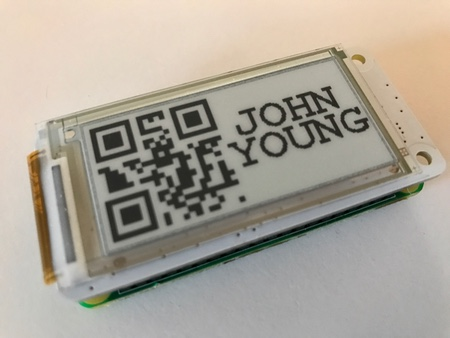

# Tikaro's Raspberry Pi Nametag Project

I've been hanging around at political gatherings, and I've noticed that nametags are getting a LOT of use.  There's a whole semantic language built up around what kind of nametag you have, and what it says.  Many committee people have made themselves [engraved plastic name tags](https://www.naagtag.com/name-tags/engraved-name-tags), which is the politics equivalent of showing up at the pool hall with your own screw-together [rock maple pool cue](https://www.amazon.com/Flourishes-Protective-Felson-Billiard-Supplies/dp/B00F53CAFK/ref=sr_1_1) in a hard-sided box.

So I am noodling around with an eInk display for a nametag.

What if your nametag was geofenced, so it showed different stuff depending on where you are? What if it showed an [augmented reality tag](https://www.youtube.com/watch?v=S4prVExYY7c) that would allow a camera taking a picture of you to augment your nametag with stuff?  What if you could update your nametag with a command to a [Slack bot](https://hubot.github.com/)?  What if your nametag could _easily_ display a QRcode for your LinkedIn profile, your Facebook Messenger code, your Snapcode, your Venmo account, etc, etc? 

What if your nametag could change to a plausible variant spelling of your name every twenty seconds, just to be a jerk? 

That's what I'm playing around with in here.

## Image Specifications
Images for display on the PaPiRus 2.0" screen should be `200x96px` and must be 1 bitmap file saved with the `.bmp` extension.

Some example images can be found in the `bmp/` folder.

## Useful Links
* **[PaPiRus](https://github.com/PiSupply/PaPiRus)**: documentation for the [PaPiRus ePaper HAT for Raspberry Pi](https://www.pi-supply.com/product/papirus-epaper-eink-screen-hat-for-raspberry-pi/) made and sold by [Pi Supply](https://www.pi-supply.com/).
